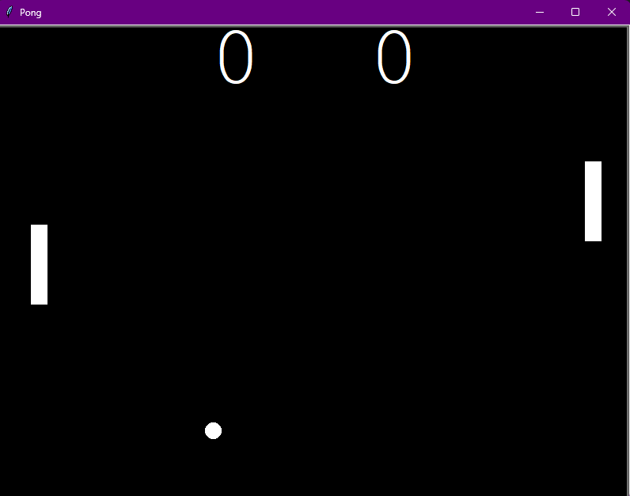

# Pong Game
# Overview
Hello, everyone! I'm Mert, and today marks Day 22 of my "100 Days of Python" challenge. For today's project, I'm thrilled to present the "Pong Game," an iconic Python program using the Turtle graphics library. This project recreates the classic Pong game, allowing players to control paddles and compete against each other.

## Project Description
In the "Pong Game," players control paddles on either side of the screen to hit a ball back and forth. The objective is to score points by making the ball pass the opponent's paddle. The game continues until one player reaches a set score. Paddle movements, ball bounces, and scoring mechanics contribute to the fast-paced and engaging gameplay.


## How to Run
To start the Pong Game, run the following command:

```bash
python main.py
```
Make sure you have Python installed on your system and all python files are in the same folder.

## Screenshot



## Project Files
* main.py: The main Python script for the Pong Game.
* paddle.py: Defines the Paddle class for player control.
* ball.py: Implements the Ball class for ball movement and interactions.
* scoreboard.py: Manages the scoring system for both players.

## Getting Started
* Control the right paddle with the Up and Down arrow keys.
* Control the left paddle with the "W" and "S" keys.
* Bounce the ball off paddles to prevent it from reaching the screen boundaries.
* Score points by making the ball pass the opponent's paddle.
* Aim to achieve the set score before your opponent.
  
## Educational Insights
This project provides hands-on experience with key Python concepts:

* Turtle Graphics: Utilizing the Turtle graphics library for interactive visual elements.
* Object-Oriented Programming: Implementing classes (Paddle, Ball) to organize code and manage game entities.
* User Input Handling: Using keyboard input to control paddle movements.
* Collision Detection: Checking for collisions between the ball and paddles, as well as screen boundaries.
* Game Logic: Implementing scoring, ball movements, and game over conditions.
  
## Customization
Feel free to customize the project by adjusting variables like paddle speed, ball speed, or the set score limit. Experiment with different colors, speeds, or add new features to enhance your Pong Game.

## Conclusion
I hope you enjoy playing the Pong Game! It's been an exciting journey reaching Day 22, and I'm eager to continue exploring and learning. Have fun competing in this classic game, and happy coding!
